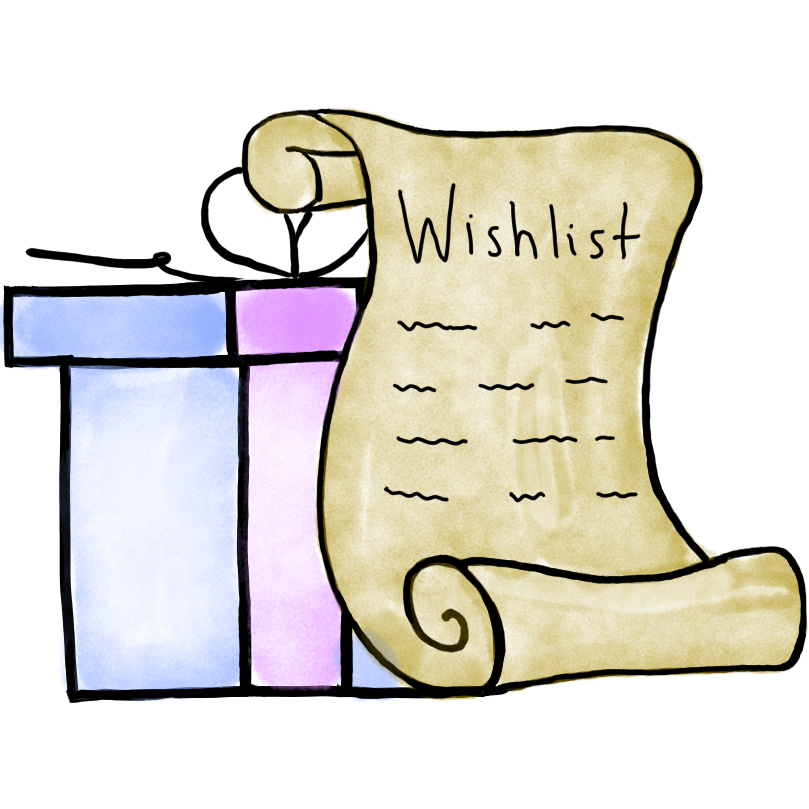

# Wishlist

> Wishlist is a self-hosted wishlist application that you can share with your friends and family.

 

![wishlist-status]
![wishlist-rootless]
![wishlist-healthchecks]
![wishlist-checks]
![wishlist-version]
![wishlist-commit]
  

- Source: https://github.com/cmintey/wishlist

<!-- Wishlist -->

[wishlist-status]: https://img.shields.io/badge/active_(in_use)-blue?style=for-the-badge&label=status
[wishlist-rootless]: https://img.shields.io/badge/yes-blue?style=for-the-badge&label=rootless
[wishlist-healthchecks]: https://img.shields.io/badge/no-red?style=for-the-badge&label=healtchecks
[wishlist-checks]: https://img.shields.io/github/actions/workflow/status/raeffs/docker-host/apps-wishlist.yml?branch=main&event=push&style=for-the-badge
[wishlist-version]: https://img.shields.io/github/v/release/cmintey/wishlist?style=for-the-badge
[wishlist-commit]: https://img.shields.io/github/last-commit/cmintey/wishlist?style=for-the-badge
